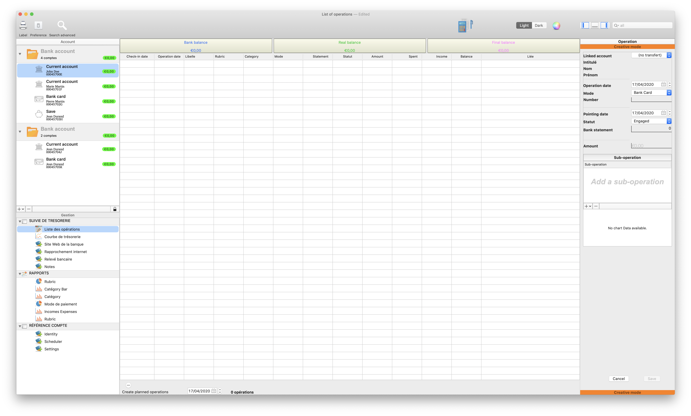
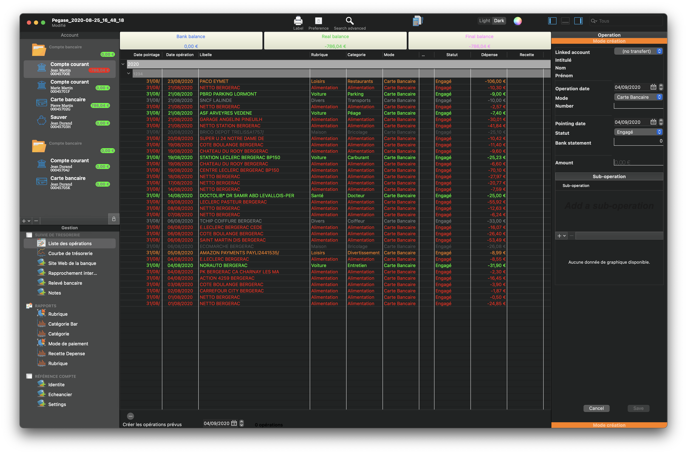
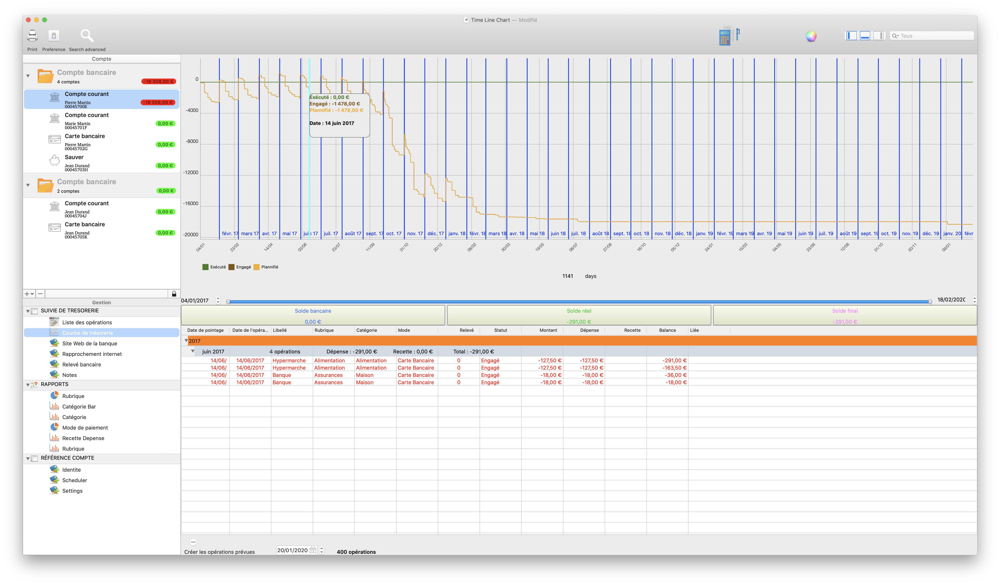
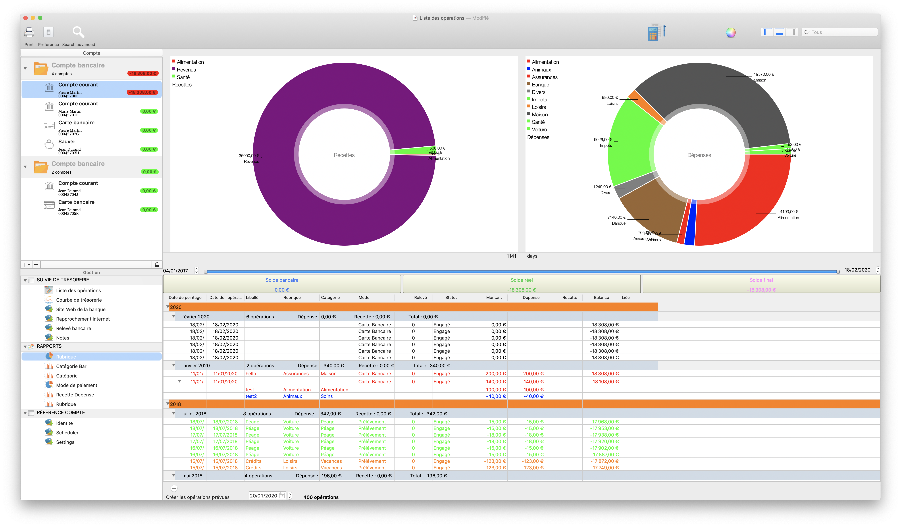
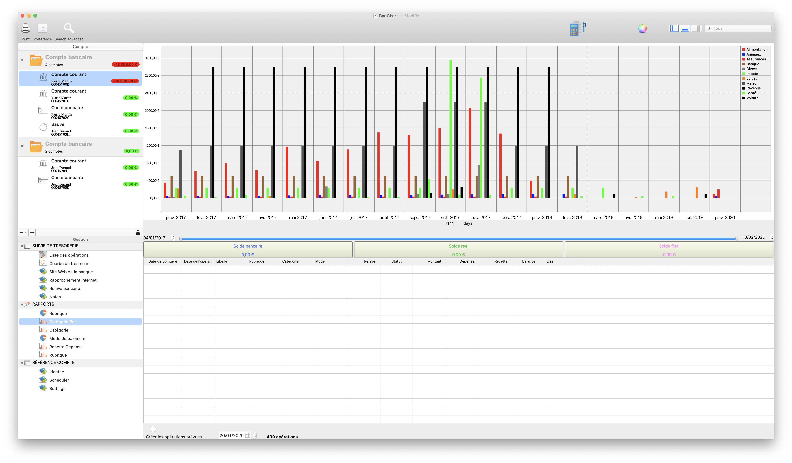
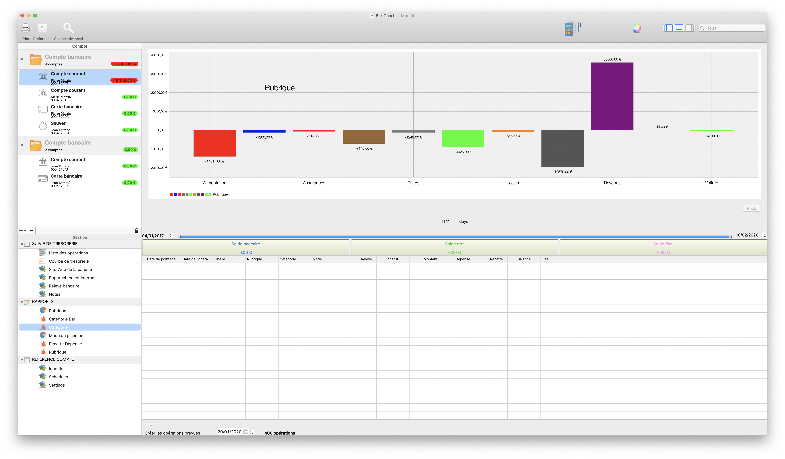
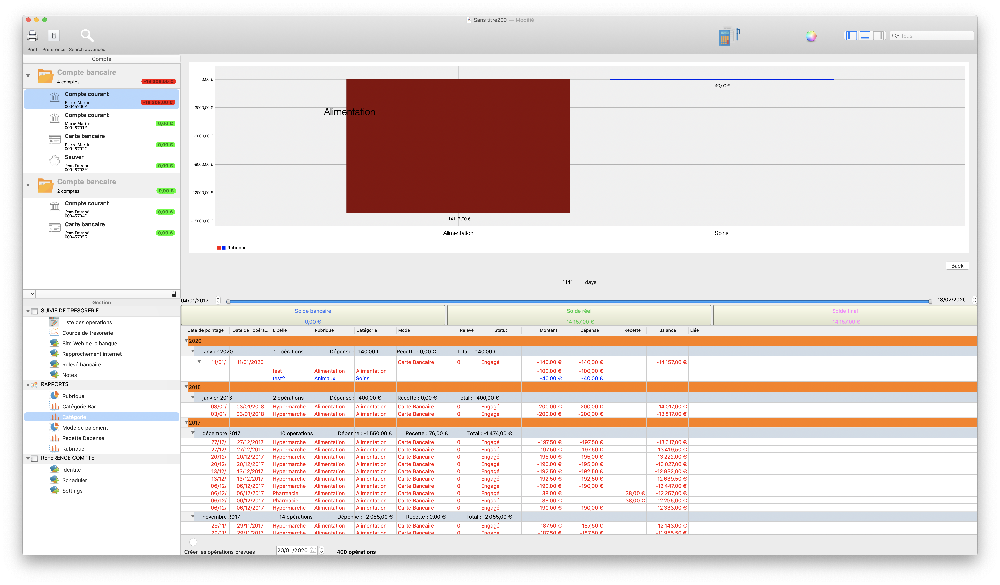
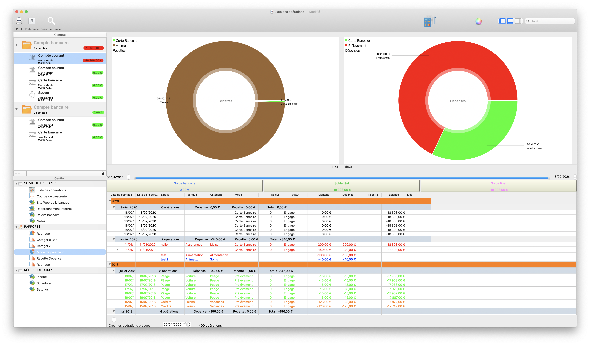
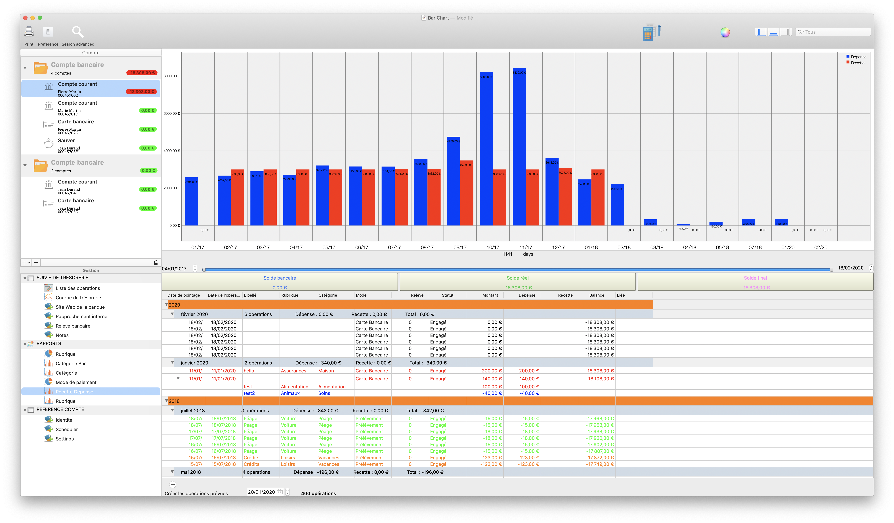

Pegase
======================

<em></em>

# 🎉 Features

 📒 Documentation
 
 https://www.lafinancepourtous.com
 https://cuisineantigaspi.com
 https://n26.com/fr-fr
 
 Règle 50/30/20 : comment épargner plus en dépensant moins
Les outils de gestion de budget trop compliqués vous dépriment ? Essayez cette règle de budget simple appelée 50/30/20 pour organiser et élaborer votre budget.

Gérer votre budget et vos finances vont de pair, mais cela ne doit pas être compliqué, ni vous prendre trop de temps. En fait, les meilleures astuces s’avèrent souvent les plus simples, étonnamment.

La règle 50/30/20 est une méthode de gestion de budget mensuelle intelligente et facile qui vous indique la somme exacte dont vous disposez pour votre épargne et vos dépenses chaque mois. En ayant une vision d’ensemble claire de votre budget du mois, vous gagnerez en confiance et éviterez de trop dépenser tout en épargnant, sans avoir à enregistrer chaque transaction.

Alors, vous êtes prêt à élaborer un budget réaliste et à vous y tenir ? C’est par ici que ça se passe !

Qu’est-ce que la règle 50/30/20 ?
La règle 50/30/20 consiste en une méthode simple pour vous aider à gérer votre budget avec efficacité, simplement et durablement. Vous répartissez vos revenus mensuels nets en trois catégories de dépenses : 50 % pour ce dont vous avez besoin, 30 % pour ce dont vous avez envie et 20 % pour votre épargne, ou pour le remboursement de vos dettes.

En équilibrant régulièrement vos dépenses à l’aide de ces trois catégories, vous serez plus conscient de vos habitudes de consommation et éviterez les dépenses à outrance. Il n'y a que trois catégories pour ne pas s'emmêler les pinceaux et pour éviter de rentrer dans le détail de chacune de vos dépenses. La règle 50/30/20 vous permettra d’atteindre facilement vos objectifs financiers, qu’il s’agisse d’épargner pour des jours moins fastes ou pour rembourser des dettes existantes.

# Quelle est l’origine de la règle 50/30/20 ?
La règle 50/30/20 provient du livre intitulé « All Your Worth: The Ultimate Lifetime Money Plan » écrit en 2005 par Elizabeth Warren, diplômée d’Harvard, experte en matière de faillites et sénatrice américaine, et sa fille Amelia Warren Tyagi.

Les 20 ans de recherche de Warren et Tyagi font écho à notre propre réflexion : il n’est pas nécessaire de respecter un budget compliqué pour contrôler ses finances. Il vous suffit de répartir votre argent de manière équilibrée en fonction de vos besoins, vos envies et vos objectifs d’épargne, en suivant simplement la règle 50/30/20.

# Comment fonctionne la règle 50/30/20 ?
La règle 50/30/20 simplifie votre budget en répartissant vos revenus nets en trois catégories de dépenses : vos besoins, vos envies et votre épargne ou vos dettes.

Si vous savez exactement combien allouer à chaque catégorie, respecter votre budget sera plus facile et vous garderez le contrôle sur vos dépenses. En utilisant la règle 50/30/20, voici à quoi votre budget pourrait ressembler :

## Dépensez 50 % de vos revenus pour vos besoins

Pour faire simple, vos besoins correspondent aux dépenses liées aux choses essentielles de la vie, dont vous pourriez difficilement vous passer. 50 % de vos revenus nets doivent couvrir la majorité de vos frais nécessaires.

Sont inclus dans les besoins :

* le loyer,

* les factures d’électricité et de gaz,

* les frais de transport,

* les assurances (santé, voiture, animaux),

* les mensualités de prêts minimales,

* l’alimentation de base.

Par exemple, si vos revenus nets s’élèvent à 2 000 €, la somme de 1 000 € doit être allouée à vos besoins. Ce budget peut varier d’une personne à une autre. Cependant, si vos besoins totaux dépassent 50 % de vos revenus nets, Warren suggère d’effectuer quelques changements afin d’assainir votre budget, comme de changer de fournisseur d’énergie ou peut-être de chercher un appartement moins onéreux.

## 30 % de votre budget pour vos envies

Si 50 % de vos revenus nets couvrent vos besoins fondamentaux, 30 % de vos revenus nets peuvent être consacrés à vos envies. Les envies se définissent comme des dépenses non-essentielles choisies librement et dont vous pourriez vous passer.

Notamment :

* les sorties au restaurant,

* le shopping,

* les vacances,

* les adhésions aux clubs de sport,

* les abonnements liés au divertissement (Netflix, Amazon Prime),

* les courses (autres qu’essentielles).

Toujours en suivant l’exemple ci-dessus, si vos revenus nets s’élèvent à 2 000 €, vous pouvez consacrer 600 € à vos envies. Mais si vous découvrez que vous dépensez trop pour vos envies, il peut être intéressant de réfléchir aux dépenses que vous pourriez limiter.

Suivre la règle 50/30/20 ne signifie pas ne pas pouvoir profiter de la vie, il s’agit uniquement d’être plus responsable vis-à-vis de votre budget en trouvant des leviers pour éviter les dépenses superflues. Si le concept de besoins et d’envies reste flou, demandez-vous tout simplement : « Est-ce que je peux vivre sans ça ? ». Si la réponse est oui, il s’agit d’une envie et non d’un besoin.

## Réservez 20 % de vos revenus à votre épargne

Avec 50 % de vos revenus nets consacrés à vos besoins et 30 % à vos envies, les 20 % restants peuvent vous permettre d’atteindre vos objectifs d’épargne, ou de rembourser d’éventuelles dettes. Bien que les remboursements minimaux sont considérés comme des besoins, tous les éventuels remboursements supplémentaires réduisent d’autant votre dette existante et vos intérêts futurs, ils sont donc classés comme de l’épargne.

Si vous épargnez systématiquement 20 % de votre salaire chaque mois, vous pourrez vous constituer un plan d’épargne intelligent, comme un fonds de secours, un budget prévisionnel personnel à long terme, ou encore un apport pour l’achat d’un bien immobilier. Si vous gagnez 2 000 € nets chaque mois, vous pourriez consacrer 400 € à vos objectifs d’épargne. Vous pourriez vous approcher des 5 000 € en un an seulement !

Comment mettre en application la règle 50/30/20 : un guide étape par étape
Alors comment fonctionne concrètement la règle 50/30/20 ? Pour faire simple, calculez les pourcentages 50 30 20 à partir de vos revenus et catégorisez vos dépenses. Voici comment faire :

# 1. Calculez vos revenus nets.

La première étape dans l’utilisation de la règle 50/30/20 consiste à calculer vos revenus après impôts. Si vous êtes indépendant, vos revenus nets correspondent à ce que vous gagnez en un mois, moins vos charges professionnelles et le montant prévu pour vos impôts.

Si vous êtes salarié avec un salaire fixe, ce sera plus facile : sur votre bulletin de paie figure le montant qui vous est versé chaque mois sur votre compte bancaire. Si certains paiements tels que l’assurance maladie ou la caisse de retraite sont déduits de votre salaire, réintégrez-les.

# 2. Catégorisez vos dépenses du mois dernier

Pour savoir où part votre argent chaque mois, vous devrez analyser comment vous avez dépensé votre salaire le mois dernier. Munissez-vous d’une copie de votre relevé bancaire des 30 derniers jours, ou utilisez simplement la fonctionnalité Statistiques dans votre application N26, qui classe toutes vos transactions dans différentes catégories : salaire, alimentation et courses, ou loisirs et sorties, etc. 

Répartissez maintenant vos dépenses en trois catégories : besoins, envies et épargne. Rappelez-vous qu’un besoin est une dépense essentielle que vous ne pouvez pas éviter, comme le loyer. Une envie est un « bonus » dont vous pourriez vous passer, comme une sortie au restaurant. L’épargne représente les mensualités de prêts supplémentaires, les cotisations retraites, ou l’argent que vous réservez pour les périodes moins fastes.

# 3. Évaluez et ajustez vos dépenses pour respecter la règle 50/30/20.

Maintenant que vous pouvez voir les sommes allouées à vos besoins, vos envies et votre épargne chaque mois, vous pouvez commencer à optimiser votre budget en fonction de la règle 50/30/20. La meilleure manière de procéder est d’estimer combien vous dépensez mensuellement pour vos envies.

Selon la règle 50/30/20, une envie n’a rien d’extravagant, c’est un plaisir simple qui vous permet de profiter de la vie. Réduire ses besoins peut représenter une tâche complexe et un véritable défi, il vaut donc mieux réfléchir aux envies que vous souhaitez limiter pour rester dans les 30 % de vos revenus nets. Plus vous réduisez vos dépenses liées à vos envies, plus la probabilité d’atteindre l’objectif des 20 % consacrés à votre épargne est élevée.

Calculatrice règle 50/30/20
Une calculatrice en ligne spéciale règle 50/30/20 pourrait vous permettre d’aller plus vite et plus facilement. Nerdwallet et Moneyfit proposent tous deux des calculatrices en ligne qui vous indiqueront les sommes à allouer à vos besoins, vos envies et votre épargne chaque mois, en se basant sur vos revenus nets.

Feuille de calcul règle 50/30/20
Alors qu’une calculatrice en ligne est capable de fournir une vue d’ensemble de votre budget idéal selon la règle 50/30/20, si vous souhaitez élaborer un budget plus détaillé, une feuille de calcul spéciale règle 50/30/20 représente une bonne option. Les logiciels tels que Microsoft Excel, Google Sheets et Apple Numbers proposent tous des modèles de feuilles de calculs pour faciliter la gestion du budget. Vous pourrez trouver de nombreuses feuilles de calculs en ligne disponibles gratuitement, adaptées à la règle 50/30/20 et qui sont compatibles avec n’importe quel programme, pour vous permettre d’atteindre vos objectifs financiers.

Votre argent chez N26
La gestion du budget est idéale pour se sentir plus rassuré et contrôler ses dépenses. Avec N26, gérer votre argent devient un jeu d’enfant. En effet, grâce à des fonctionnalités intelligentes de gestion de budget telles que les Arrondis, les sous-coptes Espaces ou encore les Statistiques, vous aurez plus de facilité à appliquer la règle du 50/30/20. Accédez à votre argent n’importe où avec votre compte bancaire en ligne et recevez des notifications push instantanées pour avoir une vision actualisée de vos finances. Et en plus, vos Espaces sous-comptes gratuits vous aident à garder un œil sur vos objectifs d’épargne, alors que la fonctionnalité Statistiques catégorisera automatiquement vos dépenses pour vous aider à maintenir le cap.

 
# Personal account software

Bergerac is a beautifully easy tool to keep track of your financial life on all your macOS 

Bien vu !!!!!

**Un oeil sur votre budget**

* **Identifier** les postes de dépenses (alimentation, énergie, frais financiers, loisirs...)
* **Faire le point** chaque mois sur l'évolution de vos dépenses courantes
* **Limiter** certains achats non indispensables, sans vous priver pour autant
* **Vous fixer** des objectifs et des limites
* **Epargner** à votre tythme, même des petites sommes, pour parer aux imprévus sans mettre à mal votre budget.

Nous vous souhaitons à tous de belle économies.

<em>DarkMode</em> 

---
#  How to manage your monthly budget well ?

It is necessary, in part:

Know your fixed monthly expenses (rent, transport, electricity / water, telephone, internet, etc.)

Define a budget to control expenses that vary from one month to another and this by category, examples: Entertainment and outings, Shopping, etc.

Monitor this budget monthly, correct in case of overruns or even redefine it if necessary!

Set an annual budget for trips or vacations.

Trying to control yourself without depriving yourself too much and especially not buying what you don't need, because by doing so you would be risking selling what you need most.

## Screenshots

-----

<em>Rubric Bar</em>

<em>Category Bar</em>

<em>Category Bar</em>

<em>Category</em>

<em>Tresorerie</em>

<em>Mode paiement</em>

<em>Income and expense</em>

## Compatibility

OS X 10.14 or later, 64-bit processor

---
## Installation

## Pack Manager
Bergerac include pack Manager

## Manually
Download and drop /Sources folder in your project.
Congratulations!

You must integrate into your project manually.
- TFDate

#### What does “Bergerac” mean?

[Click here.](http://letmegooglethat.com/?q=define+Bergerac)

# Contributing 🙌

- If you **need help** or you'd like to **ask a general question**, open an issue.
- If you **found a bug**, open an issue.
- If you **have a feature request**, open an issue.
- If you **want to contribute**, submit a pull request.

Feel free to contribute to this project by providing ideas or opening pull requests with new features or solving an existing issue.

## Acknowledgements

Thanks to everyone who helped test this software and contributed suggestions.

## Stargazers over time

